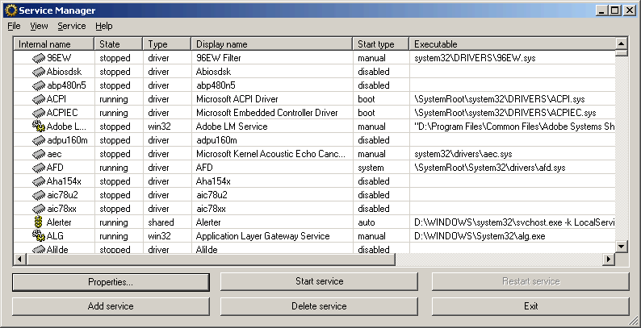

# Windows Service Manager (SrvMan)

Windows Service Manager is a small tool that simplifies all common tasks related to Windows services. It can create services (both Win32 and Legacy Driver) without restarting Windows, delete existing services and change service configuration. It has both GUI and Command-line modes. It can also be used to run arbitrary Win32 applications as services (when such service is stopped, main application window is closed automatically).



## Features
Here is a list of SrvMan's key features:

1. Allows creating driver and Win32 services without restarting.
1. Supports both GUI and Command Line.
1. Supports all modern 32-bit and 64-bit versions of Windows
1. Allws running arbitrary Win32 applications as services.
1. Allows installing & running legacy driver services in a single command line call.

## SrvMan - Command Line Options

You can use SrvMan's Command Line interface to perform the following tasks:

1. Create services
1. Deleting services
1. Start/stop/restart services
1. Install & start a legacy driver with a single call

Note that when you run SrvMan with command-line arguments from non-console application (for example, from a Run dialog box), it displays the "Press any key to continue..." message and pauses just before exiting. This does not happen, when SrvMan is run from a console application (such as cmd.exe). To override this behavior, use the /pause:no switch.

## Creating services
Use the following command line to create services using SrvMan (parameters in brackets are optional):

srvman.exe add <file.exe/file.sys> [service name] [display name] [/type:<service type>] [/start:<start mode>] [/interactive:no] [/overwrite:yes]
Service name is an internal name used by Windows to reference the service. Display name is the name displayed in Windows Services snap-in. By default, both names are generated from the .exe or .sys file name, however, you can override it by specifying names explicitly.

Service type can be one of the following:

1. drv - Create a kernel driver (selected by default for .sys files)
1. exe - Create a Win32 service (selected by default for .exe files)
1. sharedexe - Create a Win32 service with shared executable file
1. fsd - Create a file system driver service
1. app - Create a service running ordinary windows application (such as taskmgr.exe)

Start mode is one of the following:

1. boot - The service is started by OS loader
1. sys - The service is started by IoInitSystem() call
1. auto - The service is started by Service Control Manager during startup
1. man - The service is started manually (net start/net stop)
1. dis - The service cannot be started

Win32 services are created as interactive by default. To create a non-interactive service, you should specify the /interactive:no parameter. Normally, if a specified service already exists, SrvMan reports an error and stops. However, if you specify the /overwrite:yes parameter, an existing service will be overwritten instead.

## Deleting services
Deleting services using SrvMan command line is quite obvious:

```
	srvman.exe delete <service name>
```
Note that you need to specify the internal service name (same as used for net start command), not the display name.

Starting/stopping/restarting services
You can control all types of services using SrvMan command line:
```
	srvman.exe start <service name> [/nowait] [/delay:<delay in msec>]
	srvman.exe stop <service name> [/nowait] [/delay:<delay in msec>]
	srvman.exe restart <service name> [/delay:<delay in msec>]
```

Normally, SrvMan waits for the service to start. However, if you specify the /nowait parameter, SrvMan will return control immediately after the start/stop request was issued. Note that if you need SrvMan to wait before starting/stopping the service (for example, to switch to real-time log viewer window), you can use the /delay:<delay in msec> parameter.

Note that you need [bazislib](https://sysprogs.com/legacy/bazislib) library to build the sources.
